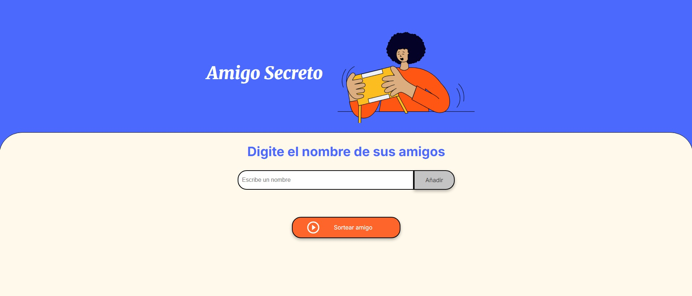
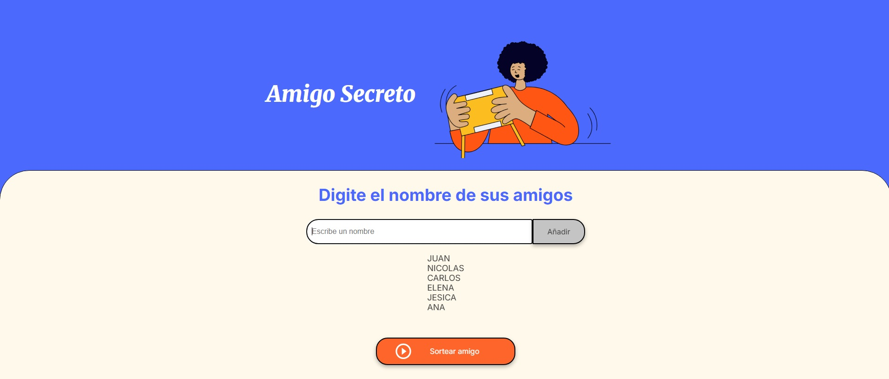
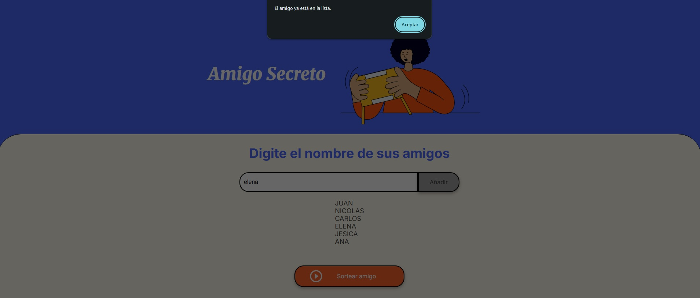
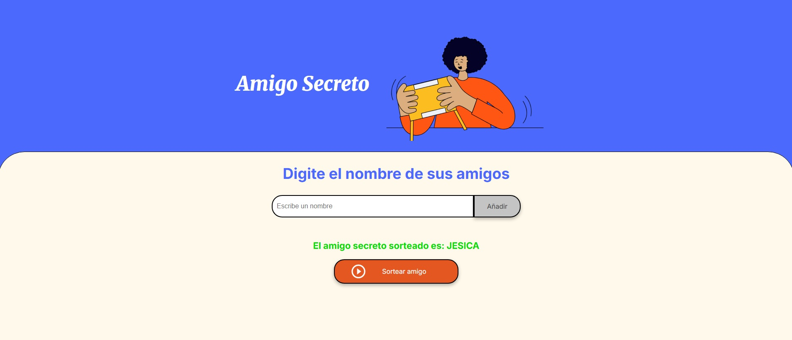

# Challenge Amigo Secreto
## _Esto es un juego de sortear a un amigo_

Esto es juego donde se sortea a un grupo de amigos los cuales son ingresados por el usuario que realizara el sorteo.

## Funcionalidad
- Ingresara un nombre de algun amigo en cuadro de texto y se agregara a la lista a traves del boton "Añadir"
- En caso de ser un amigo que ya se encuentre en la lista, se mostrara un mensaje de alerta diciendole "El amigo ya esta en la lista"
- Elegira un amigo a traves del boton "sortear amigo" de manera aleatoria

## Capturas del proyecto
Pagina inicial

Agregando amigos a la lista

Ingresando un amigo que ya se encuentra en la lista

Mostrando al amigo que ha sido sorteado

## Tecnologias

Las tecnologias principales que se usaron para el proyecto fueron:

- JavaScript
- HTML
- CSS
- Visual Studio Code

## Pasos a seguir
- Agregar más validaciones en el ingreso de los datos
- Mejorar el estilo de la lista
- Mejorar el estilo del mensaje al sortear un amigo

y como siempre en el desarrollo de software hay que seguir refactorizando, mejorando y agregando nuevas funciones a la aplicacion.

